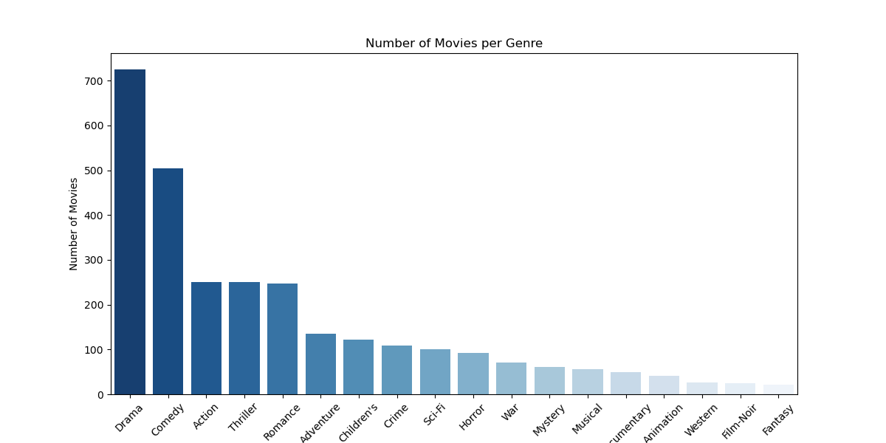
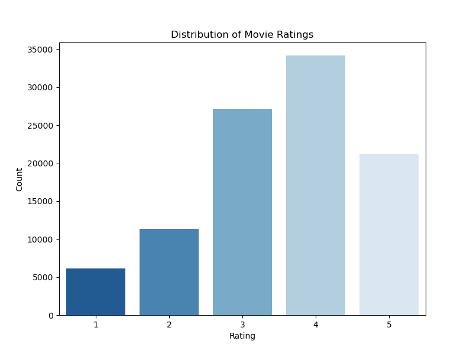
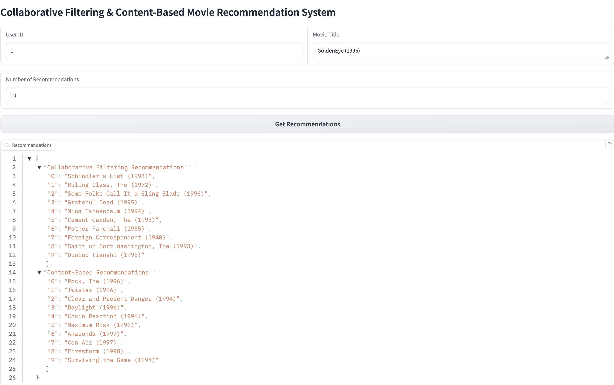
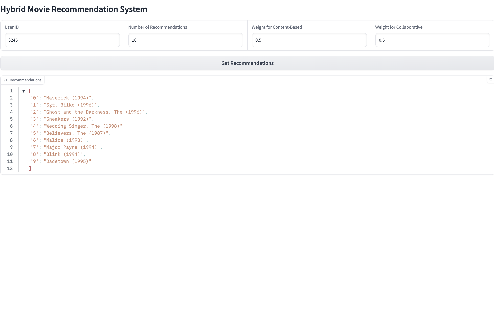

# **Personalized Movie Recommendation System**

## **Content**
- [Introduction](#introduction)
- [Project Structure](#project-structure)
- [Directory Structure](#directory-structure)
- [EDA](#eda)
- [Data Preprocessing](#data-preprocessing)
- [Model Building](#model-building)
- [Interactive Interface](#interactive-interface)
- [Conclusion](#conclusion)

## **Introduction**
This project is an end-to-end Movie Recommendation System built using Content-Based Filtering, Collaborative Filtering, and a Hybrid Recommendation Model. It aims to provide movie recommendations based on both user preferences and movie features (genres), leveraging both collaborative and content-based methods.

## **Project Structure**
The project is structured into the following main components:
- **Data Preprocessing:** Prepares and cleans the data for model building.
- **Recommendation Models:**
    - Content-Based Filtering
    - Collaborative Filtering
    - Hybrid Recommendation System
- **Interactive Interface:** A demo interface using Gradio where users can get movie recommendations based on their user ID or movie title.

## **Directory Structure**

- **data/:** Contains the raw and processed datasets.
- **models/:** Contains the saved model and cosine similarity matrix.
- **notebooks/:** Jupyter notebooks used for exploration, training, and evaluation.
- **deployment/:** Gradio app for interactive recommendations.
- **scripts/:** Scripts for data cleaning and preprocessing, model training and movie recommendation function.
- **plots/:** Contains graphs.
- **results:** Images of Gradio apps.
- **README.md:** Project documentation.
- **requirements.txt:** Project dependencies

## **EDA**
<p align="left">
  
  
</p>

## **Data Preprocessing**
The data consists of three main datasets:
- **u.data:** User ratings for movies.
- **u.item:** Movie metadata (title, genres).
- **u.user:** User demographics (age, gender, occupation).

Preprocessing includes cleaning the data, handling missing values, and feature engineering (e.g., extracting genre information).

**Data Files:**
- **`content_based_data.csv`:** Cleaned movie metadata used for content-based recommendations.
- **`collaborative_filtering_data.csv`:** Cleaned user rating data used for collaborative filtering.
- **`hybrid_data.csv`:** Merged data used for the hybrid recommendation model.

## **Model Building**
- **Content-Based Filtering:** Uses TF-IDF on movie genres and cosine similarity to recommend similar movies based on a user’s watch history.

- **Collaborative Filtering:** Implemented using the KNNBasic algorithm from the surprise library with the Pearson baseline similarity measure to recommend movies based on other users' preferences.

- **Hybrid Model:** Combines content-based and collaborative filtering by calculating weighted predictions from both models.

**Model Performance**
- **Collaborative Filtering (KNNBasic, Pearson baseline):** RMSE = 0.9969

## **Interactive Interface**
The project includes two Gradio-based interactive interfaces that allow users to explore different recommendation techniques:

1. **Content-Based and Collaborative Filtering Interface (`app_content_colab.py`):**
    - Users can input a User ID for collaborative filtering recommendations based on other users’ preferences and a Movie Title for content-based recommendations based on movie genres.
    - The interface provides both sets of recommendations.

2. **Hybrid Recommendation Interface (`app_hybrid.py`):**

    - Users can input a User ID, the number of recommendations (n), and weights for both content-based and collaborative filtering.
    - The hybrid model uses a weighted average to combine both approaches and recommend movies based on the user’s watch history and the genres of the movies they’ve watched.

### **How to Use the Interfaces:**
On the terminal, change directory to the base folder and run `pip install -r requirements.txt` to install dependencies.

1. **Content-Based and Collaborative Filtering Interface**

    The interface allows users to explore two recommendation techniques side-by-side:

    - **Collaborative Filtering:** Recommends movies based on user preferences, calculated from other users’ ratings.
    - **Content-Based Filtering:** Recommends movies similar to a given movie based on genre similarity.

    **To use the app:** Navigate to the `deployment` directory and run the following;
    ```bash
    python app_content_colab.py
    ```
    After running the app, Gradio will open the interface in your browser, and you can interact with the model in real-time.
    
    The interface will prompt you for:
    - **User ID:** Input the user ID for collaborative recommendations.
    - **Movie Title:** Input a movie title to get content-based recommendations.
    - **Number of Recommendations:** Select how many recommendations you want (default is 10).

        

2. **Hybrid Recommendation Interface**
    This interface allows users to interact with the hybrid recommendation system, adjusting the weight between collaborative and content-based models:

    **To use the app:** Navigate to the `deployment` directory and run the following;
    ```bash
    python app_hybrid.py
    ```
    After running the app, Gradio will open the interface in your browser, and you can interact with the model in real-time.

    The interface will prompt you for:

    - **User ID:** Select the user for which you want recommendations.
    - **Number of Recommendations:** The number of recommendations to return (default is 10).
    - **Weight for Content-Based:** The weight given to the content-based model (default is 0.5).
    - **Weight for Collaborative:** The weight given to the collaborative model (default is 0.5). 

        

## **Conclusion**
This project demonstrates the development of a comprehensive movie recommendation system using both content-based and collaborative filtering techniques. By combining these methods into a hybrid model, the system can provide personalized movie recommendations that balance user preferences and movie similarities. The project showcases the full pipeline from data preprocessing to model training and deployment, offering an interactive interface for users to explore different recommendation approaches. This implementation highlights the effectiveness of hybrid models in delivering more accurate and relevant recommendations, enhancing the overall user experience.